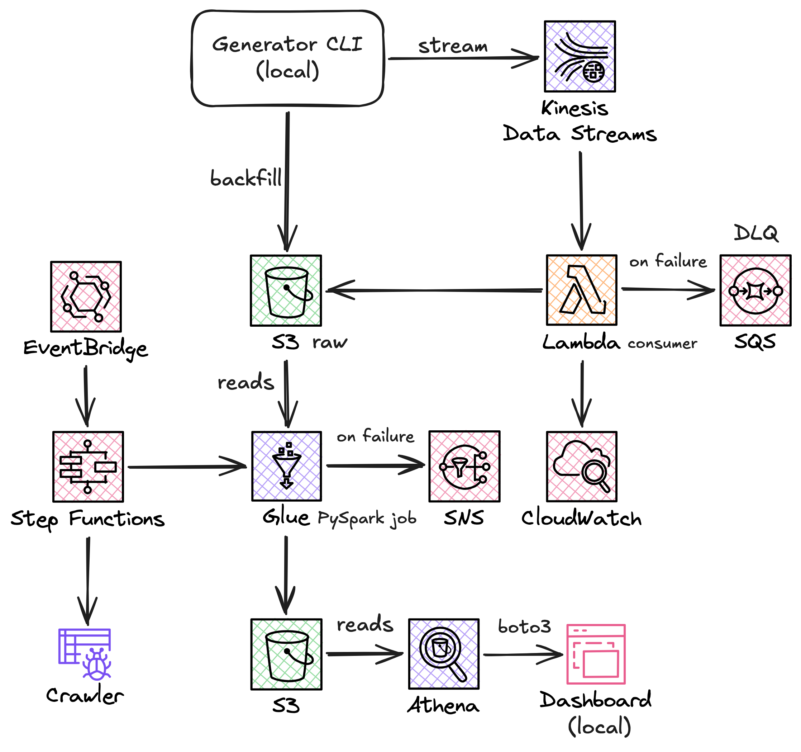
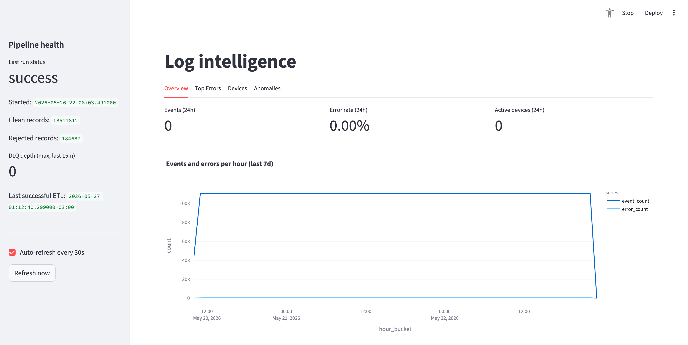
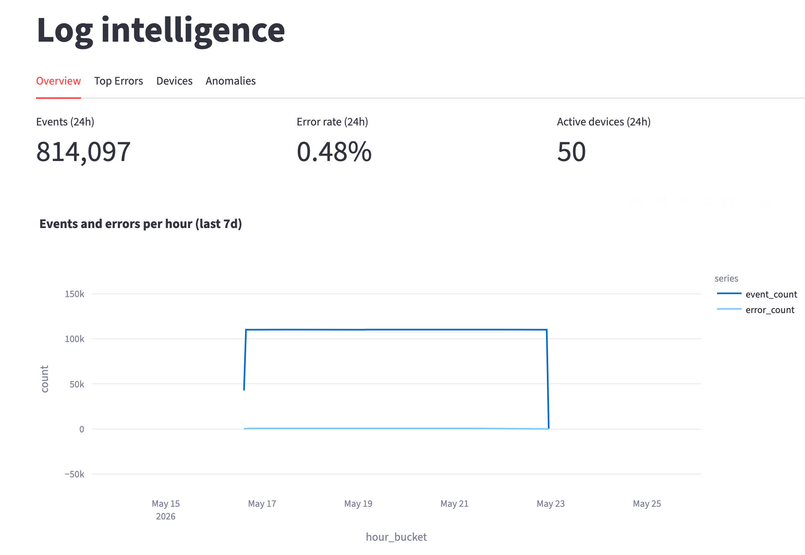
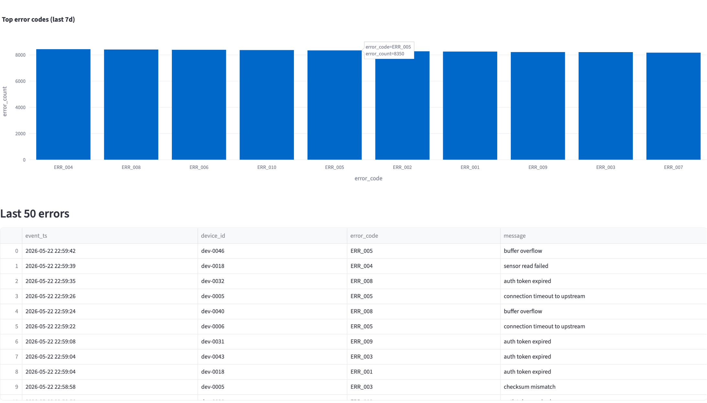
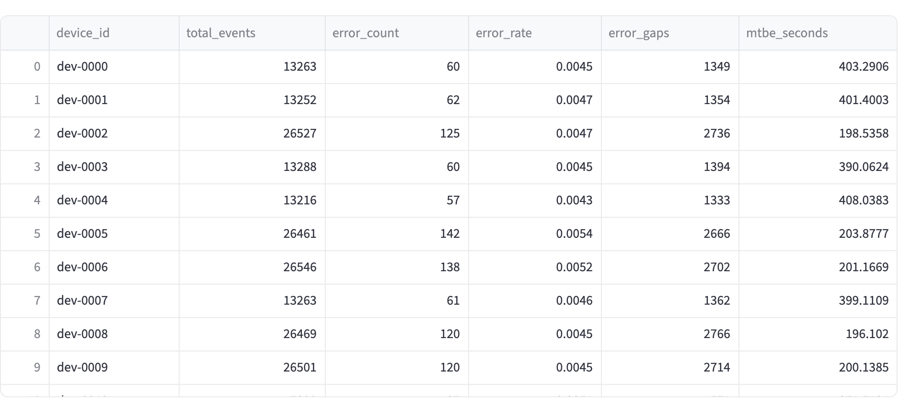
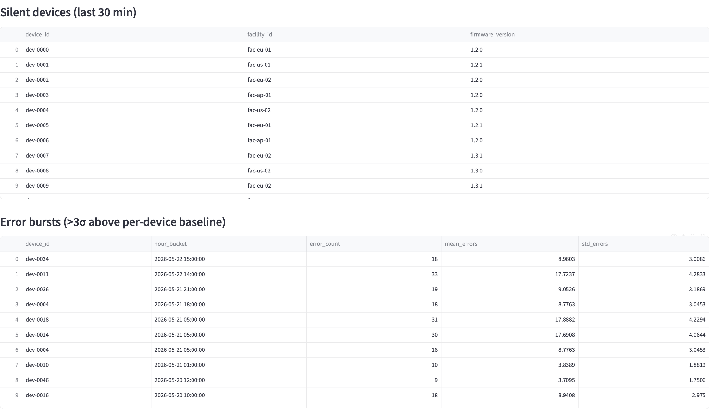
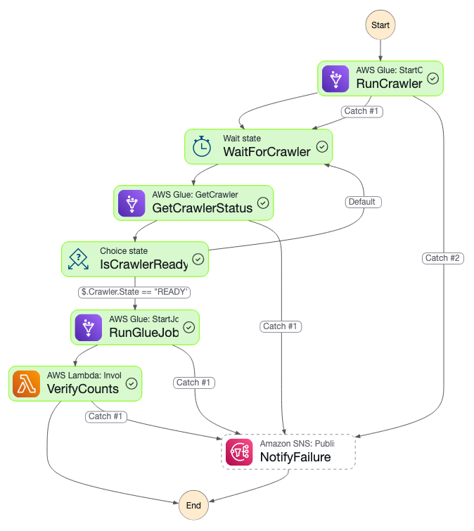

# Log Intelligence Pipeline

[](https://github.com/danshurko/log-intelligence-pipeline/actions/workflows/ci.yml)

An end-to-end data pipeline that ingests, processes, and analyzes IoT device logs on AWS. A local generator streams simulated device telemetry into Kinesis, Lambda validates and writes it to S3, a PySpark Glue job transforms the data into a star schema, and a Streamlit dashboard surfaces anomalies and device-level metrics via Athena.

The pipeline has processed over **18.5 million events** across a simulated fleet of 50 devices, catching ~184K rejected records (duplicates, malformed JSON, clock-drift outliers) and detecting error bursts three standard deviations above per-device baselines.

## Architecture



**Layers:**

- **Ingestion** – Kinesis Data Streams + Lambda. Lambda validates each record with Pydantic, deduplicates within the batch, groups by `dt/hour` partition, and writes Parquet to S3. Failed batches land in an SQS Dead Letter Queue.
- **Storage** – S3 in three zones: `raw` (as-arrived), `staging` (cleaned, typed), `curated` (star schema). Partitioned Parquet throughout.
- **Processing** – Glue PySpark job running SparkSQL. Transforms raw → staging → curated in sequence. Implements SCD Type 2 on `dim_devices` to track firmware and facility changes over time.
- **Orchestration** – Step Functions state machine triggered by EventBridge every hour: Crawler → PySpark ETL → verify row counts. SNS email alert on any failure.
- **Analytics** – Athena queries the curated star schema via Glue Catalog. All metric logic lives in standalone `.sql` files.
- **Visualization** – Streamlit dashboard (local), querying Athena via boto3 with 30-second auto-refresh.

## Star schema

| Table | Type | Description |
| --- | --- | --- |
| `dim_devices` | SCD2 dimension | One row per device-state version; tracks firmware and facility changes |
| `dim_firmware` | Dimension | One row per firmware version with first-observed timestamp |
| `dim_facilities` | Dimension | One row per facility with region |
| `fct_events` | Fact | One row per event; 18.5M rows |
| `fct_errors` | Fact | Error subset of fct_events; 92K rows |
| `pipeline_runs` | Audit | One row per ETL execution with processed/rejected counts |

## Tech stack and reasoning

| Choice | Reasoning |
| --- | --- |
| **Kinesis Data Streams** | Managed streaming with 24h replay; Lambda integration is explicit rather than hidden (unlike Firehose) |
| **Lambda** (not Firehose) | Per-record validation and deduplication logic before the data touches S3 |
| **Glue PySpark** | Scales to larger datasets without re-engineering; SparkSQL keeps transform logic in portable `.sql` files |
| **Athena** | Serverless, pay-per-query, zero ops – the right fit for analytical workloads on partitioned Parquet |
| **Step Functions** | Visual execution traces, built-in retry/catch, and each state failure routes to SNS |
| **Streamlit** | Python-native, free, fast to iterate on – no separate BI server needed |
| **Terraform** | All infra is code; `make demo-up` and `make demo-down-streaming` reproducibly create and tear down the stack |

The SQL transform files are written in a SparkSQL/Athena-compatible dialect and double as DuckDB unit tests – the same `.sql` files run against in-memory fixture data in CI without touching AWS.

## Sample data

The generator simulates a fleet of **50 IoT devices** spread across 5 facilities (`fac-eu-01`, `fac-us-01`, etc.) running three device types (sensor, gateway, controller) across firmware versions `1.2.x` and `1.3.x`.

Each device emits events at a realistic rate (0.2–5 Hz depending on type). The generator injects realistic noise:

| Issue | Rate | Purpose |
| --- | --- | --- |
| Duplicate `event_id` | 1% | Kinesis at-least-once delivery |
| Missing optional fields | 2% | Incomplete sensor payloads |
| Malformed JSON | 0.3% | Corrupted network packets |
| Out-of-order timestamps | 0.5% | Device clock drift |
| Future timestamps | 0.1% | Clock skew after firmware update |

Four demo scenarios are available via `--scenario`:

- `normal` – baseline noise
- `error-burst` – one device emits 50× its normal error rate for 5 minutes
- `silent-device` – a device stops emitting entirely
- `firmware-issue` – devices on firmware `1.3.x` show elevated errors

**Historical backfill stats** (7 days of generated data, 50 devices):

| Metric | Value |
| --- | --- |
| Raw records ingested | 18,696,499 |
| Clean records written | 18,511,812 (99.0%) |
| Rejected records | 184,687 (1.0%) |
| ETL duration | ~4 minutes |
| Devices tracked | 50 |
| Error events | 92,837 |

## Quick start

Requirements: AWS credentials configured, Terraform and `uv` installed, Docker (for the Lambda layer build).

```bash
# 1. Deploy AWS infrastructure
make demo-up

# 2. Populate with historical data
make backfill          # 7 days of events written directly to S3

# 3. Run the ETL pipeline
make trigger-etl       # Step Functions: Crawler → PySpark → Verify

# 4. Open the dashboard
make dashboard         # http://localhost:8501

# 5. Tear down streaming resources when done
make demo-down-streaming
```

To see anomaly detection in action:

```bash
make stream            # streams live events via Kinesis for 5 min
# in another terminal, try: make stream --scenario error-burst
make trigger-etl       # re-run ETL to pick up the new events
make dashboard         # check the Anomalies tab
```

## Dashboard

The Streamlit dashboard runs locally and queries Athena. Launch it with `make dashboard` – it opens at `http://localhost:8501`.

**Four tabs:**

- **Overview** – total events, error rate, active devices in the last 24h; time-series chart of events and errors per hour
- **Top Errors** – bar chart of the 10 most frequent error codes over 7 days; table of the 50 most recent errors
- **Devices** – per-device breakdown with total events, error count, error rate, MTBE (mean time between errors), and last-seen timestamp
- **Anomalies** – silent devices (no events in last 30 min), error bursts (exceeding 3 standard deviations above the per-device 7-day baseline), error rate by firmware cohort

The sidebar shows the last pipeline run status, clean/rejected record counts, DLQ depth, and the last successful ETL timestamp.

## Screenshots

**General view**


**Overview**


**Top errors**


**Device breakdown**


**Anomaly detection**


**Step Functions execution**



## Available commands

``` bash
make help                show all commands

make demo-up             terraform apply the full stack (builds Lambda layer first)
make demo-down-streaming destroy Kinesis + Lambda only (keeps S3, Glue, SFN)
make build-lambda-layer  build the Lambda dependency layer (Linux x86_64 via Docker)

make crawler             start the Glue raw-zone crawler
make crawler-status      print current crawler state
make trigger-etl         start a Step Functions execution
make etl-status          show the last 5 executions

make backfill            write 7 days of historical events to S3
make stream              stream live events to Kinesis for 5 minutes

make dashboard           run the Streamlit dashboard
make test                run pytest
make lint                ruff check
make fmt                 format Python and Terraform
```

## What I'd improve next

A few things I'd tackle with more time:

- **Partitioned writes from Glue** – the PySpark job currently overwrites curated tables in full. Switching to incremental writes partitioned by `dt` would cut job runtime significantly as data grows.
- **Data quality framework** – replacing custom row-count checks with Great Expectations to provide richer, declarative validation and reduce boilerplate code.
